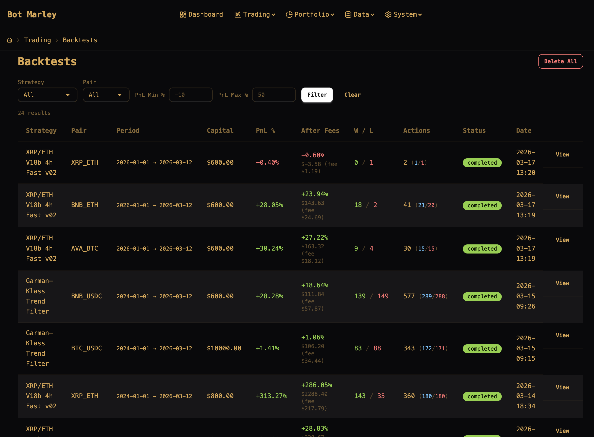
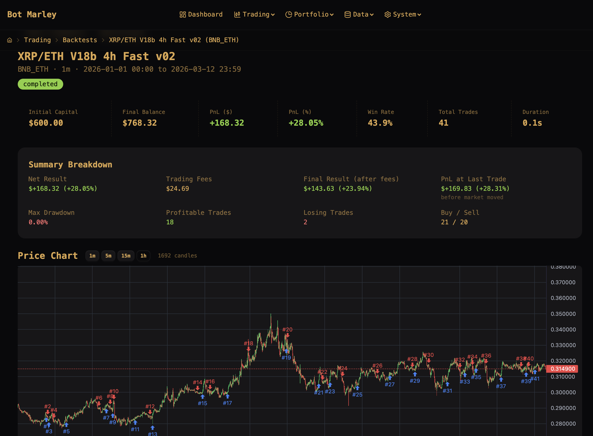
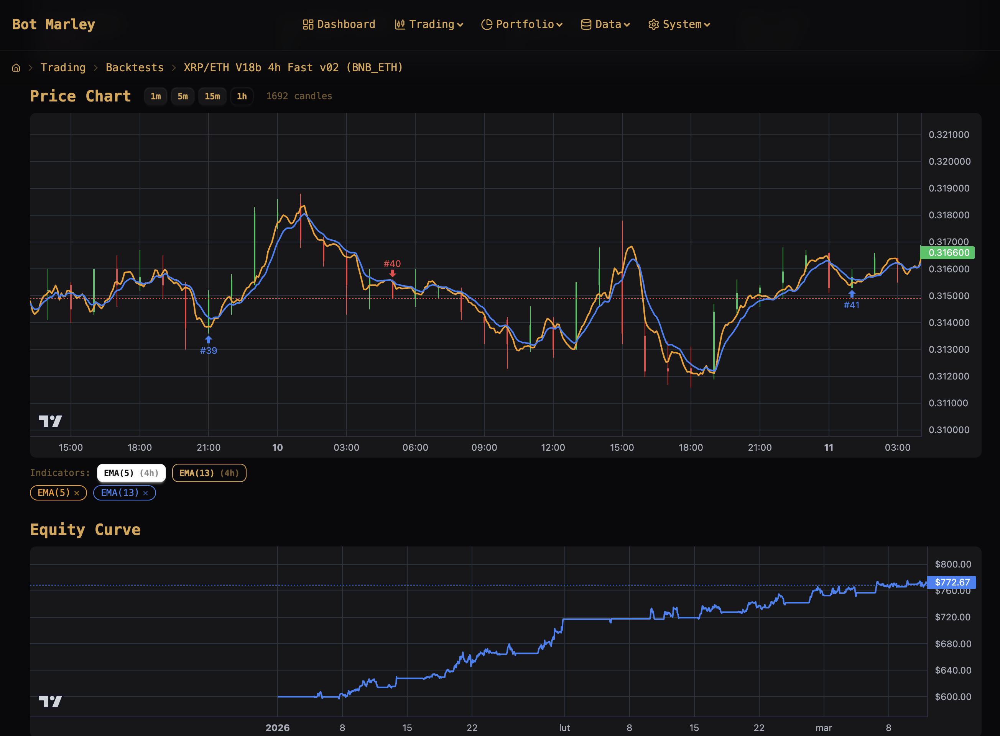
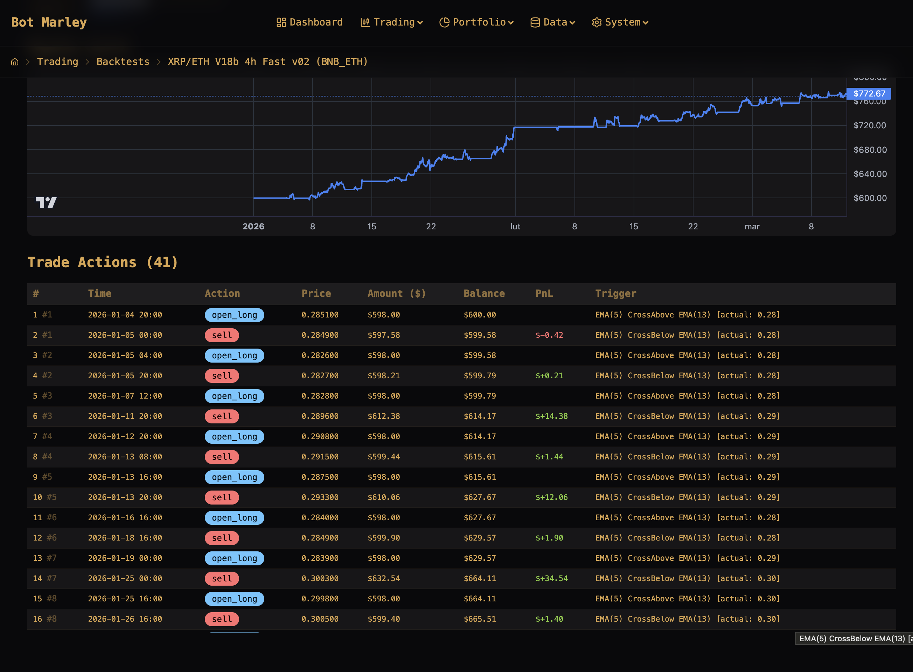
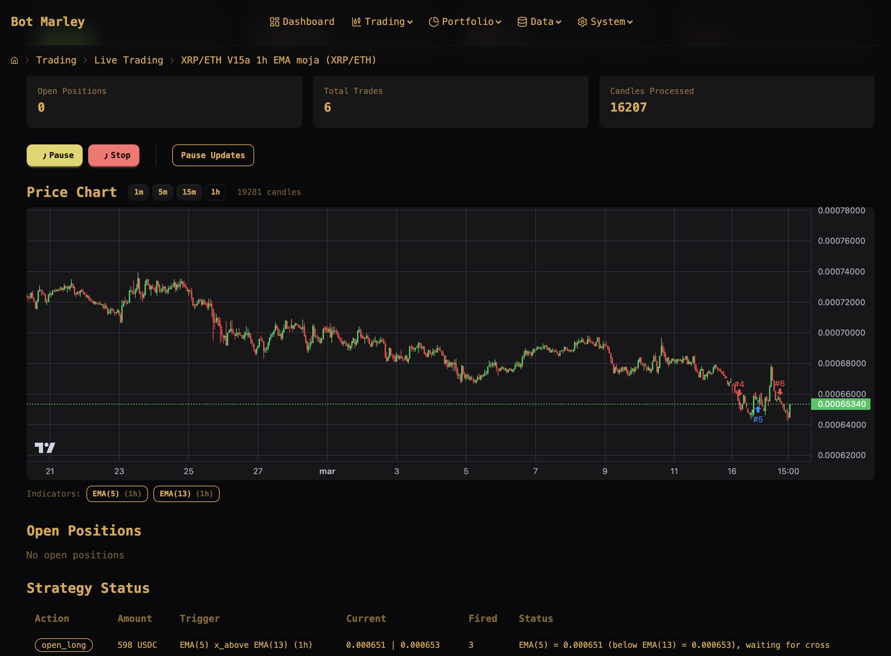
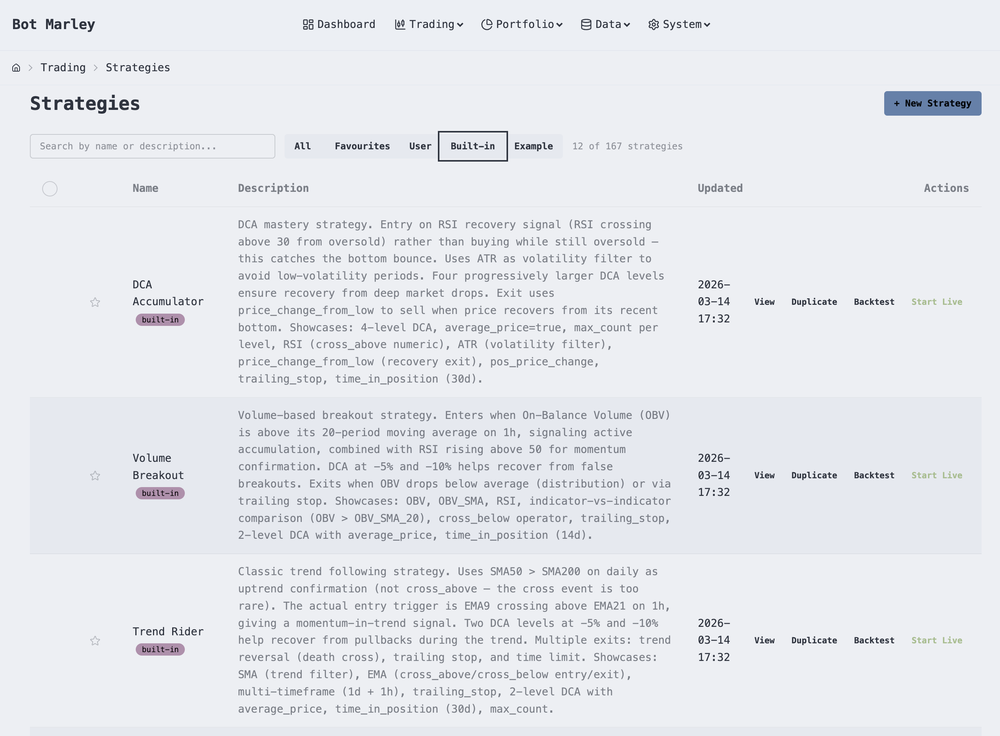
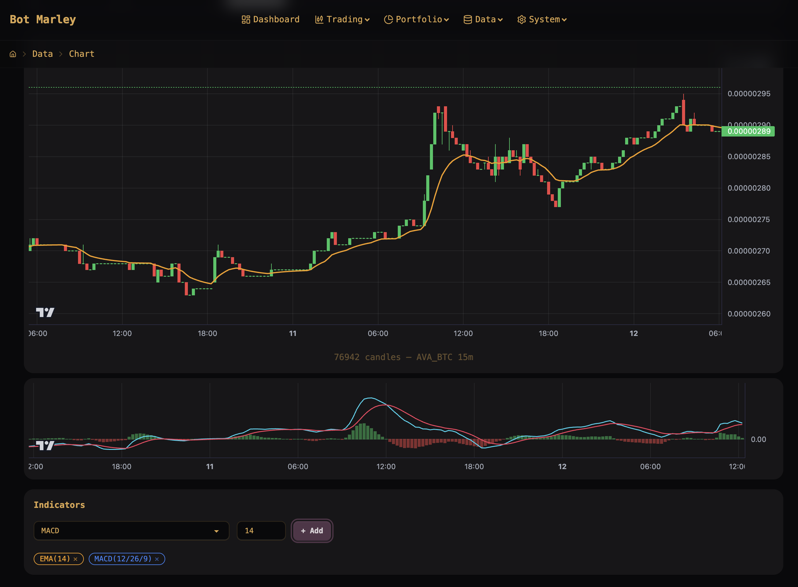
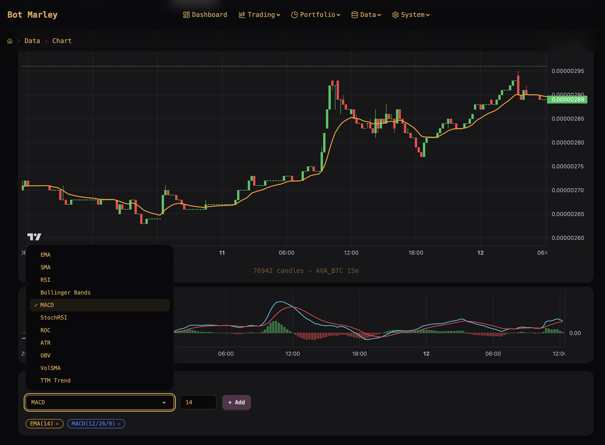

<p align="center">
  
</p>

<h1 align="center">Botmarley</h1>

<p align="center">
  <strong>Self-hosted, sovereign cryptocurrency trading bot</strong><br>
  Built in Rust. Blazing fast. Fully yours.
</p>

<p align="center">
  <a href="https://mi4uu.github.io/botmarley-book/">Read the Documentation</a>
</p>

---

## What is Botmarley?

Botmarley is a **self-hosted cryptocurrency trading bot** that runs entirely on your own hardware. You define trading strategies, backtest them against historical data, and execute them live on **Kraken** and **Binance** — 24/7, without watching charts.

No cloud services. No third-party access to your funds. No monthly subscriptions.

**You install it, you run it, you own it.**

## Key Features

- **Strategy Editor** — Visual builder and raw TOML editor for defining trading rules with real-time validation
- **28+ Technical Indicators** — SMA, EMA, RSI, MACD, Bollinger Bands, VWAP, StochRSI, ATR, and many more
- **Backtesting** — Test strategies against historical data before risking real money
- **Live Trading** — Execute strategies in real-time on Kraken and Binance with start/pause/resume controls
- **Portfolio Tracking** — Track total portfolio value over time in USD and BTC
- **Market Data** — Download, browse, chart, and analyze historical candle data
- **Dashboard** — At-a-glance overview of active sessions, total PnL, and quick navigation
- **Telegram Notifications** — Get alerts on trades, session events, and errors
- **Password Protection** — Optional authentication for remote access
- **35+ UI Themes** — DaisyUI-powered theme system with dark mode support

## Tech Stack

Botmarley is built with performance and reliability in mind:

- **Rust** + **Tokio** + **Axum** — Blazing-fast async server with minimal resource usage
- **HTMX** + **SSE** — Reactive web interface with real-time updates, no JavaScript framework overhead
- **PostgreSQL** — Battle-tested database for state, logs, and configuration
- **Apache Arrow** — High-performance columnar format for historical market data

## Quick Start

**1. Download** the latest release from [GitHub Releases](https://github.com/mi4uu/botmarley/releases/latest)

**2. Start PostgreSQL**
```bash
docker compose up -d postgres
```

**3. Run Botmarley**
```bash
./server
```

**4. Open** your browser at [http://localhost:3000](http://localhost:3000)

That's it. Full documentation at **[mi4uu.github.io/botmarley-book](https://mi4uu.github.io/botmarley-book/)**.

## Documentation

The complete user manual covers everything from installation to advanced strategy building:

- [Installation](https://mi4uu.github.io/botmarley-book/getting-started/installation.html)
- [Strategy Editor](https://mi4uu.github.io/botmarley-book/strategies/editor.html)
- [Indicators Reference](https://mi4uu.github.io/botmarley-book/strategies/indicators.html)
- [Backtesting](https://mi4uu.github.io/botmarley-book/backtesting/overview.html)
- [Live Trading](https://mi4uu.github.io/botmarley-book/trading/overview.html)
- [Production Deployment](https://mi4uu.github.io/botmarley-book/deployment/production.html)

## Screenshots

<p align="center">
  
  <br><em>Backtests — run strategies against historical data, compare results across pairs and timeframes</em>
</p>

<p align="center">
  
  <br><em>Backtest Detail — full stats breakdown with PnL, win rate, drawdown, and interactive chart</em>
</p>

<p align="center">
  
  <br><em>Charts & Equity Curve — price action with indicator overlays and portfolio growth over time</em>
</p>

<p align="center">
  
  <br><em>Trade Actions — every buy/sell with price, amount, balance, PnL, and trigger details</em>
</p>

<p align="center">
  
  <br><em>Live Trading — real-time candlestick chart with trade markers, strategy status, and session controls</em>
</p>

<p align="center">
  
  <br><em>Strategy Library — browse built-in strategies, create your own, backtest or start live with one click</em>
</p>

<p align="center">
  
  <br><em>Market Data — interactive candlestick charts with MACD, EMA, and 13+ technical indicators</em>
</p>

<p align="center">
  
  <br><em>Indicators — EMA, SMA, RSI, Bollinger Bands, MACD, StochRSI, ATR, OBV, and more</em>
</p>

## License

Proprietary. All rights reserved.
